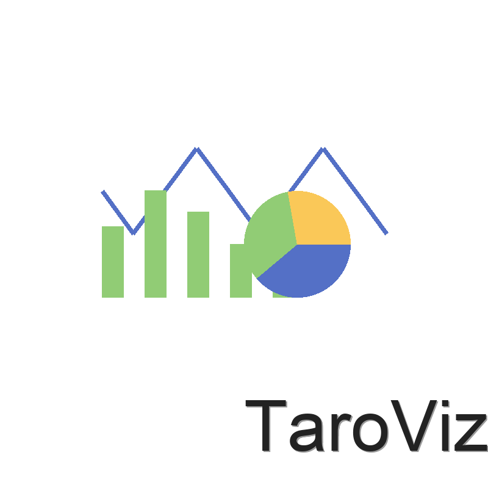

# TaroViz 文档中心

<div align="center">
  
  <h1>TaroViz</h1>
  <p>基于 Taro 和 ECharts 的多端图表组件库</p>
</div>

## 📖 文档导航

- **[API 文档](../docs-api/index.html)** - 详细的 API 参考文档
- **[使用指南](./USAGE.md)** - 快速上手和最佳实践
- **[开发指南](./DEVELOPMENT.md)** - 参与项目开发
- **[配置选项](./OPTIONS.md)** - 组件配置详解
- **[示例](./EXAMPLES.md)** - 丰富的代码示例
- **[常见问题](./FAQ.md)** - 常见问题解答
- **[更新日志](./CHANGELOG.md)** - 版本历史和变更记录

## 🚀 快速开始

```bash
# 安装
npm install @agions/taroviz

# 或使用 pnpm
pnpm add @agions/taroviz
```

基本使用示例：

```jsx
import { LineChart } from '@agions/taroviz';

const App = () => {
  const data = {
    xAxis: ['Mon', 'Tue', 'Wed', 'Thu', 'Fri'],
    series: [150, 230, 224, 218, 135]
  };

  return (
    <LineChart
      data={data}
      width={350}
      height={250}
    />
  );
};
```

## 📦 包结构

TaroViz 采用模块化设计，包含以下核心包：

| 包名                                          | 描述        |
| --------------------------------------------- | ----------- |
| [@agions/taroviz](../packages/all)               | 完整功能包  |
| [@agions/taroviz-core](../packages/core)         | 核心组件    |
| [@agions/taroviz-charts](../packages/charts)     | 图表组件    |
| [@agions/taroviz-hooks](../packages/hooks)       | React Hooks |
| [@agions/taroviz-themes](../packages/themes)     | 主题系统    |
| [@agions/taroviz-data](../packages/data)         | 数据处理    |
| [@agions/taroviz-adapters](../packages/adapters) | 平台适配器  |

## 📱 平台支持

- 小程序：微信、支付宝、百度、字节跳动
- H5

## 🔗 相关链接

- [GitHub 仓库](https://github.com/agions/taroviz)
- [NPM 包](https://www.npmjs.com/package/@agions/taroviz)
- [问题反馈](https://github.com/agions/taroviz/issues)
